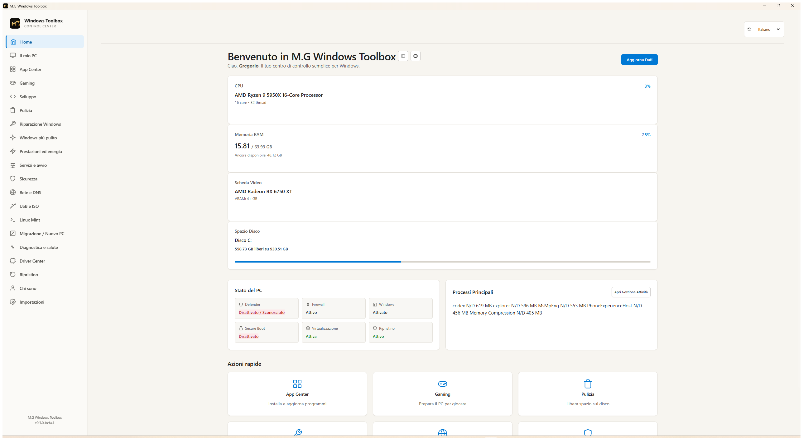
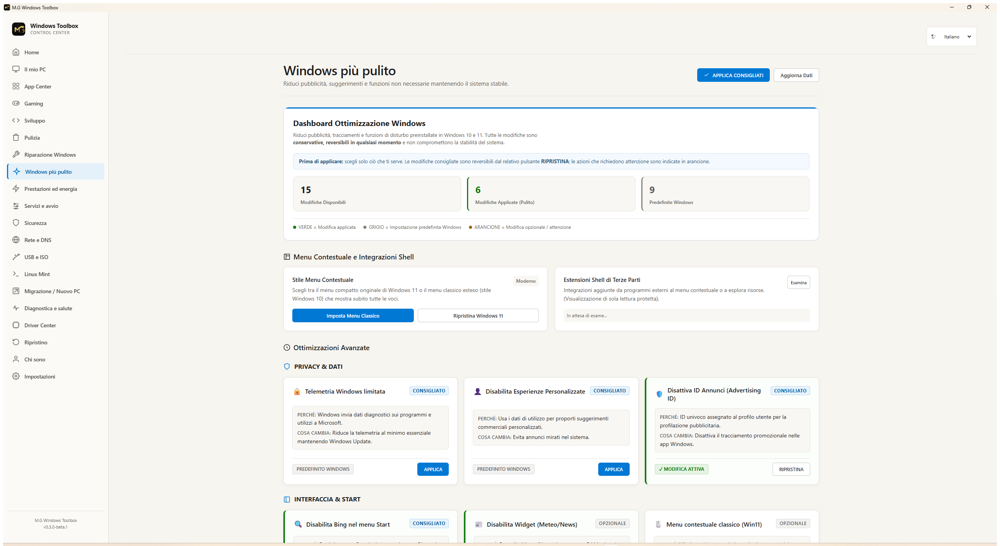
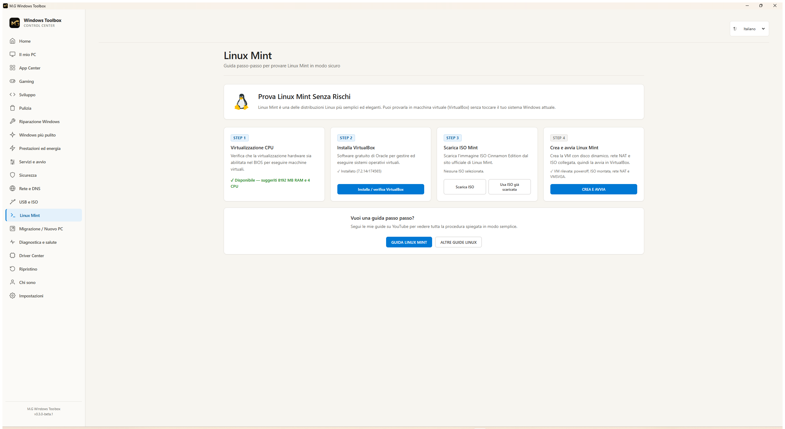

# M.G Windows Toolbox

> Un centro di controllo semplice per Windows che raccoglie installazione software, manutenzione, riparazione, sicurezza, gaming, driver, rete, Linux Mint e altre funzioni in un'unica interfaccia grafica.

**Versione disponibile:** 0.3.0-beta.4 — Beta pubblica per Windows 10 e Windows 11 a 64 bit.

## Che cos'è

M.G Windows Toolbox è pensato per chi vuole trovare gli strumenti utili per il proprio PC in un solo posto, senza dover conoscere PowerShell o comandi tecnici.

Il programma mostra lo stato reale del sistema e spiega, prima di agire, che cosa fa ogni funzione. Alcune operazioni usano gli strumenti ufficiali già presenti in Windows e possono chiedere l'autorizzazione amministratore: è normale quando si modifica un'impostazione di sistema.

## Cosa puoi fare

- **Home e Il mio PC** — vedere informazioni su hardware, dischi e stato generale del PC.
- **App Center** — cercare, installare, aggiornare o rimuovere programmi tramite WinGet.
- **Disinstalla programmi** — visualizzare e rimuovere software desktop e applicazioni Microsoft Store realmente installate, anche quando non fanno parte dell'App Center.
- **Intelligenza Artificiale** — trovare assistenti AI, strumenti per il terminale e programmi AI locali.
- **Gaming e Sviluppo** — raccogliere strumenti utili per giocare o programmare.
- **Pulizia** — controllare file temporanei e spazio recuperabile prima di scegliere cosa eliminare.
- **Riparazione Windows** — avviare strumenti Windows per controllare e riparare componenti di sistema.
- **Windows più pulito** — gestire alcuni suggerimenti, pubblicità e impostazioni leggere con possibilità di ripristino dello stato precedente.
- **Prestazioni ed energia** — consultare profili energetici, sospensione e stato dei dischi.
- **Servizi e avvio** — leggere e gestire servizi Windows con protezione per quelli importanti.
- **Sicurezza** — vedere Defender, Firewall e protezioni del PC.
- **Rete e DNS** — controllare la connessione e scegliere DNS con ripristino della configurazione salvata.
- **USB e ISO** — trovare Rufus, immagini ISO ufficiali e unità USB collegate.
- **Linux Mint** — preparare in modo guidato una macchina virtuale con VirtualBox, senza modificare Windows.
- **Migrazione / Nuovo PC** — preparare un kit per reinstallare applicazioni, driver e impostazioni supportate dopo una formattazione.
- **Diagnostica e salute** — leggere in modo semplice problemi recenti, arresti anomali e stato del sistema.
- **Driver Center e Ripristino** — conservare driver prima di formattare e aprire gli strumenti ufficiali di ripristino.

Il Toolbox non promette PC più veloci, più FPS o una connessione migliore in ogni situazione. Leggi sempre ciò che viene mostrato prima di confermare una modifica.

## Screenshot

| Home | Windows più pulito |
| --- | --- |
|  |  |

| Linux Mint |
| --- |
|  |

## Download e installazione

**Guida completa, installazione e spiegazione delle funzioni:**

[https://www.manganogregorio.it/m-g-windows-toolbox/](https://www.manganogregorio.it/m-g-windows-toolbox/)

### Metodo consigliato — Installazione automatica con PowerShell

Questo metodo scarica soltanto la release ufficiale `v0.3.0-beta.4`, controlla automaticamente il checksum SHA-256, installa il programma nella cartella personale di Windows e crea il collegamento nel menu Start. Se il Toolbox è già installato con questo metodo, aggiorna o ripara l'installazione senza richiedere la disinstallazione.

Prima di iniziare, tieni presente che:

- il pacchetto è grande circa **138,1 MiB**;
- il download può richiedere diversi minuti, in base alla velocità della connessione;
- durante il download PowerShell può mostrare **“Scrittura richiesta Web”** oppure **“Scrittura del flusso di richiesta in corso...”**;
- questi messaggi sono normali e non significano che PowerShell si sia bloccato;
- **non chiudere PowerShell** e **non rilanciare il comando**;
- attendi fino a quando compare il messaggio **“Installazione completata.”**.

Segui questi passaggi:

1. Apri **Start**.
2. Cerca **PowerShell**.
3. Aprilo normalmente, senza scegliere l'avvio come amministratore.
4. Incolla questo comando:

```powershell
irm https://raw.githubusercontent.com/gregoriomangano/mg-windows-toolbox/main/install.ps1 | iex
```

5. Premi **Invio**.
6. Aspetta la fine senza chiudere PowerShell e senza inserire di nuovo il comando.
7. Cerca **M.G Windows Toolbox** nel menu Start quando compare **“Installazione completata.”**.

Lo script non disabilita SmartScreen o Defender e non modifica permanentemente le policy PowerShell. Se il checksum non corrisponde, l'installazione viene interrotta.

Per disinstallare soltanto il programma installato con questo metodo e il relativo collegamento nel menu Start:

```powershell
irm https://raw.githubusercontent.com/gregoriomangano/mg-windows-toolbox/main/uninstall.ps1 | iex
```

### Metodo manuale — Scarica direttamente lo ZIP

**[⬇️ Scarica M.G Windows Toolbox 0.3.0 Beta 4](https://github.com/gregoriomangano/mg-windows-toolbox/releases/download/v0.3.0-beta.4/MG_Windows_Toolbox_0.3.0-beta.4_win64.zip)**

1. Scarica il file ZIP.
2. Fai clic destro sul file e scegli **Estrai tutto...**.
3. Apri la cartella estratta.
4. Apri `M.G Windows Toolbox-win32-x64`.
5. Fai doppio clic su **M.G Windows Toolbox.exe**.

Non spostare soltanto l'EXE fuori dalla cartella: gli altri file presenti nella stessa cartella sono necessari al programma.

- [Pagina Release 0.3.0 Beta 4](https://github.com/gregoriomangano/mg-windows-toolbox/releases/tag/v0.3.0-beta.4)
- [Scarica SHA256SUMS.txt](https://github.com/gregoriomangano/mg-windows-toolbox/releases/download/v0.3.0-beta.4/SHA256SUMS.txt)

**SHA-256 del pacchetto ZIP:**

`16F6A5FF6F73A3C2FD05511EA8C86EE2CE4F356A39DA955079F2F1E9C81067A5`

### Se compare Windows SmartScreen

Questa prima Beta non possiede ancora una firma digitale. Per questo Windows può mostrare un avviso al primo avvio.

Se hai scaricato il file dalla release ufficiale e hai controllato l'hash SHA-256, il comportamento standard è:

1. nella finestra SmartScreen seleziona **Ulteriori informazioni**;
2. controlla che il file sia `M.G Windows Toolbox.exe`;
3. seleziona **Esegui comunque**.

SmartScreen non deve essere disattivato. Questa indicazione vale solo per l'EXE verificato della release ufficiale. Per i dettagli, leggi la [guida per principianti](docs/INSTALLAZIONE.md).

### Quando Windows chiede l'autorizzazione

L'app può avviarsi normalmente. Windows chiede UAC soltanto per funzioni che modificano impostazioni di sistema, ad esempio una riparazione o un cambio di configurazione. Leggi il messaggio, poi conferma solo se riconosci l'operazione scelta nel Toolbox.

## Beta e limiti

M.G Windows Toolbox 0.3.0-beta.4 è una **Beta**. Possono ancora esserci bug o differenze tra PC, versioni di Windows, driver e componenti installati. Alcune azioni sono reversibili, altre richiedono attenzione: il programma prova a indicarlo prima della conferma.

Non usare il Toolbox per formattare dischi, modificare BIOS/firmware o rimuovere driver senza sapere esattamente che cosa stai facendo. Per USB e ISO, la scelta e la scrittura del dispositivo restano sempre sotto il controllo dell'utente.

## Autore

M.G Windows Toolbox è sviluppato da **Gregorio Mangano**, autore del progetto e creator del canale YouTube.

- YouTube: https://www.youtube.com/@GregorioMangano
- Sito: https://www.manganogregorio.it/
- Contatti: https://www.manganogregorio.it/contatti-gregorio-mangano-mondovi/

## Codice e licenze

M.G Windows Toolbox per Windows è software proprietario e closed source. Il codice sorgente non viene distribuito pubblicamente.

Le licenze e i notice dei componenti di terze parti realmente inclusi sono disponibili in [THIRD_PARTY_NOTICES.md](THIRD_PARTY_NOTICES.md) e nella cartella del programma distribuito.

## Documenti utili

- [Guida di installazione per principianti](docs/INSTALLAZIONE.md)
- [Changelog](CHANGELOG.md)
- [Nota SmartScreen](SMARTSCREEN_NOTE.md)
- [Notice di terze parti](THIRD_PARTY_NOTICES.md)
